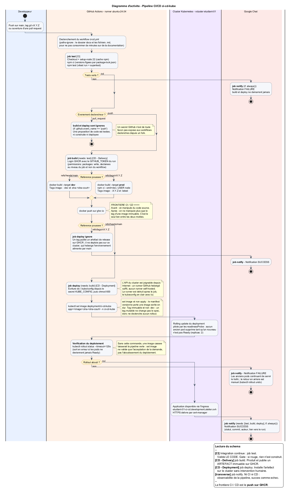

# ci-cd-kube

Pipeline d'intégration et de déploiement continus construite avec GitHub
Actions, Docker et Kubernetes. Un push sur `main` déclenche les tests, la
construction d'une image, sa publication sur GHCR, son déploiement sur un
cluster Kubernetes et une notification Google Chat. Le tout est automatisé.

L'application est déployée sur : <https://etudiant-01-ci-cd.development.atelier.ovh>

L'application Express est juste un prétexte : tout l'intérêt du projet est la
pipeline et la configuration Kubernetes.

## Vue d'ensemble

[](docs/pipeline-ci-cd.png)

Diagramme d'activité complet : [`docs/pipeline-ci-cd.png`](docs/pipeline-ci-cd.png)
(source PlantUML : [`docs/pipeline-ci-cd.puml`](docs/pipeline-ci-cd.puml)).

Les quatre jobs sont chaînés entre eux grâce à `needs:` : `test` est un verrou,
rien n'est construit si les tests échouent, et rien n'est déployé si l'image
n'est pas publiée.

## L'application

Une API Express minimale :

| Fichier         | Rôle                                                    |
| --------------- | ------------------------------------------------------- |
| `src/app.js`    | déclare les routes et **exporte** l'app sans l'écouter  |
| `src/server.js` | importe l'app et appelle `listen()`                     |

Cette séparation permet de tester les routes sans ouvrir de port.

Deux routes : `GET /` renvoie un message et une version, `GET /health` renvoie
`{ "status": "ok" }` 

## Structure du dépôt

```
.github/workflows/ci-cd.yml   pipeline complete, quatre jobs
tests/                        tests Vitest + Supertest
Dockerfile                    multi-stage, targets dev et prod
compose.yaml                  confort local pour bind mounting, hors pipeline
k8s/deployment.yaml           replicas, resources, probes
k8s/service.yaml              ClusterIP, port 80 -> 3000
k8s/ingress.yaml              hote public, TLS Let's Encrypt
docs/                         schema de pipeline, burn down
scripts/burndown.py           outillage de suivi, lit les issues GitHub
```

## La pipeline

### Les déclencheurs

```yaml
on:
  push:
    branches: [main]
    tags: ['v*.*.*']
    paths-ignore: ['docs/**', '**.md']
  pull_request:
    branches: [main]
```

### Job `test`

`npm ci` plutôt que `npm install` : `ci` installe exactement les versions
figées dans `package-lock.json` et échoue si le lockfile est désynchronisé du
`package.json`.

### Job `build` et stratégie de tags

| Déclencheur     | Target Docker | Tags publiés                    |
| --------------- | ------------- | ------------------------------- |
| push sur `main` | `dev`         | `:dev` et `:sha-<commit-court>` |
| tag `vX.Y.Z`    | `prod`        | `:X.Y.Z` et `:latest`           |

L'authentification à GHCR utilise le `GITHUB_TOKEN` fourni automatiquement à
chaque run : aucun secret à créer pour le registre. Les permissions sont
déclarées au niveau du job (`packages: write`) et non en tête de fichier, pour
que les autres jobs n'en héritent pas.

### Job `deploy`

Réservé aux push sur `main` :

```yaml
if: github.event_name == 'push' && github.ref == 'refs/heads/main'
```

Le runner GitHub est une machine vierge : il reçoit l'accès au cluster en
reconstituant un kubeconfig depuis le secret `KUBE_CONFIG`, puis met à jour
l'image du déploiement :

```bash
kubectl set image deployment/ci-cd-kube app=$IMAGE:sha-${GITHUB_SHA:0:7} -n ci-cd-kube
kubectl rollout status deployment/ci-cd-kube -n ci-cd-kube --timeout=120s
```

**Pourquoi `set image` et pas `kubectl apply`.** Le manifest versionné contient
une image écrite en dur. Un `apply` redéploierait donc toujours la même
version, sauf à réécrire le fichier à chaque commit. `set image` ne modifie
qu'un champ de l'objet vivant.

### Job `notify`

```yaml
needs: [test, build, deploy]
if: always()
```

`if: always()` force l'exécution même quand un job précédent a échoué. Sans
lui, la notification ne partirait que sur succès — c'est-à-dire jamais dans le
cas où elle est le plus utile.

L'URL du webhook Google Chat vit dans le secret `GOOGLE_CHAT_WEBHOOK`.

## Kubernetes

Tout est déployé dans le namespace `ci-cd-kube`, sur un cluster partagé entre
plusieurs utilisateurs. Le namespace isole les objets — les noms y sont uniques
par namespace, pas globalement.

| Manifest          | Contenu                                                                 |
| ----------------- | ----------------------------------------------------------------------- |
| `deployment.yaml` | 2 replicas, `requests` et `limits`, liveness et readiness sur `/health` |
| `service.yaml`    | `ClusterIP`, expose le port 80 vers le port 3000 des pods               |
| `ingress.yaml`    | hôte public, `ingressClassName: nginx`, TLS automatique                 |

**`replicas: 2`** est le minimum pour qu'un rolling update se fasse sans
coupure : Kubernetes remplace les pods un par un, il faut donc qu'il en reste
un pour servir le trafic.

Les valeurs retenues
(`64Mi`/`128Mi`, `50m`/`200m`) partent d'une mesure de la consommation réelle
du pod, pas d'un ordre de grandeur recopié.

Aucun ancien pod n'est supprimé tant qu'un
nouveau n'est pas prêt. Graçe à readiness et liveness

**`ClusterIP` plutôt que `NodePort` ou `LoadBalancer`.** Le Service n'a pas à
être joignable de l'extérieur : c'est l'Ingress qui expose l'application. 

Le certificat HTTPS est délivré automatiquement par cert-manager graçe à
 `cert-manager.io/cluster-issuer: letsencrypt`.

## Reproduire le projet

Prérequis : Node 22, Docker, `kubectl`, un cluster Kubernetes avec un
contrôleur ingress-nginx et cert-manager.

**1. En local**

```bash
npm ci
npm test
npm run dev
```

**2. Avec Docker**

```bash
docker compose up --build
```

**3. Sur le cluster**

```bash
kubectl create namespace ci-cd-kube
kubectl apply -f k8s/ -n ci-cd-kube
kubectl get pods -n ci-cd-kube
```

Adapter au préalable l'hôte dans `k8s/ingress.yaml` et le nom de l'image dans
`k8s/deployment.yaml`.

**4. Activer la pipeline**

Deux secrets sont à créer dans le dépôt (*Settings > Secrets and variables >
Actions*) :

| Secret | Contenu |
|---|---|
| `KUBE_CONFIG` | le kubeconfig complet donnant accès au namespace |
| `GOOGLE_CHAT_WEBHOOK` | l'URL du webhook de l'espace Google Chat |

```bash
gh secret set KUBE_CONFIG < ~/.kube/config
gh secret set GOOGLE_CHAT_WEBHOOK
```

## Rollback

```bash
kubectl rollout history deployment/ci-cd-kube -n ci-cd-kube
kubectl rollout undo deployment/ci-cd-kube -n ci-cd-kube
```

## Choix assumés

**Le dépôt et le cluster divergent.** Après un `set image`, le
`deployment.yaml` versionné porte encore l'ancien tag alors que le cluster
exécute le nouveau. Il faut faire committer le nouveau tag par la CI.
